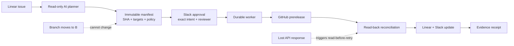

# ReleaseProof

### Approve one exact revision. Prove what actually shipped.

ReleaseProof is an evidence-backed release agent for a world where AI systems can change real infrastructure. It turns a Linear release request into an immutable authority, binds a human Slack approval to one exact commit, publishes a GitHub prerelease, reconciles uncertain API outcomes, and produces a receipt from observed remote state.

> **AI agents are starting to get permission to change real systems. ReleaseProof makes them prove they executed exactly what the human authorized—even when APIs time out, state changes underneath them, or the agent crashes halfway through.**

## The memorable demo

```text
Linear selects A
      ↓
Slack approves A
      ↓
The branch advances to B
      ↓
ReleaseProof still publishes A
      ↓
GitHub succeeds, but its response disappears
      ↓
ReleaseProof refuses to retry blindly
      ↓
It discovers the existing release by immutable marker
      ↓
Linear and Slack are reconciled
      ↓
The final receipt proves every observed outcome
```

That distinction is the product. ReleaseProof is not merely a chatbot that can call release APIs; it is an authority-and-evidence layer between an AI planner, a human reviewer, and mutable production systems.

## What the interface communicates

The operator workspace is designed around the proof story:

- a five-stage path from request to observed receipt;
- the exact approved SHA and immutable manifest hash;
- live GitHub, Slack, and Linear connection state;
- a provider-by-provider evidence receipt;
- an append-only event trail;
- explicit `reconciling` and `needs attention` states;
- version-bound retry and cancel controls.

Browser controls can request, retry, or cancel work. They cannot approve a release. Approval authority comes only from the configured Slack app, exact message, exact intent, unexpired nonce, and allowlisted reviewer.

## System flow



## Safety invariants

1. **Approval is SHA-bound.** Approval for revision A cannot authorize revision B.
2. **Target identity is configured.** The planner cannot choose another repository, Slack destination, Linear team, or check producer.
3. **Writes are reserved before dispatch.** Each external effect has a durable operation and attempt record.
4. **Unknown is not failure and not success.** A lost response moves the run into reconciliation.
5. **Retries read before writing.** ReleaseProof looks for its immutable receipt marker and never blindly duplicates an uncertain write.
6. **Completion is observed.** GitHub tag/release state, Linear state/comment, and Slack receipt are read back before the run can complete.
7. **Untrusted text remains data.** Linear descriptions and pull-request bodies cannot expand tool scope or override policy.

## Connected release workflow

| System | Role in ReleaseProof | Implemented capability |
|---|---|---|
| **Linear** | Source of release intent and final delivery record | Issue discovery, linked-PR extraction, team-bound state transition, idempotent receipt comment |
| **GitHub** | Source of revision truth and release destination | Repository identity, merged PR evidence, exact-SHA checks, nested annotated tags, prerelease publication and readback |
| **Slack** | Human authority and completion surface | Interactive approval, Socket Mode ingress, exact message/intent binding, reviewer allowlist, final receipt update |
| **Gemini** | Evidence-guided planning layer | Read-only tool calls, constrained proposal generation, strict schema validation and automatic model discovery |

Together they form one coherent transaction: Linear identifies the work, GitHub establishes the exact releasable revision, Slack grants narrowly scoped human authority, and ReleaseProof reconciles all three into one independently inspectable receipt.

## Recovery proof

The deterministic fixture campaign includes controlled response loss after:

- GitHub successfully creates the prerelease;
- Linear successfully creates the receipt comment;
- Slack successfully updates the final receipt;
- Slack successfully posts the approval prompt.

In each case, ReleaseProof reconciles the remote marker and proves that the effect was not duplicated. The automated authority and recovery suite passes **15/15 scenarios**, and the production Next.js build passes.

## Quick start

Requirements:

- Node.js `>=24.19.0 <25`
- npm

```bash
npm ci
cp .env.example .env
npm run db:migrate
npm run doctor -- fixture
npm run verify -- --phase P3 --mode fixture
npm run dev
```

Open `http://127.0.0.1:3000`.

`npm run dev`, `npm run doctor`, and `npm run model:smoke` load the ignored local `.env` automatically. Never place credentials in `.env.example` or commit `.env`.

## Configuration

Durable runtime:

```dotenv
DATABASE_PATH=var/releaseproof.sqlite
APP_ORIGIN=http://127.0.0.1:3000
OPERATOR_PASSWORD=choose-at-least-12-characters
SESSION_SECRET=choose-at-least-32-characters
RELEASEPROOF_MODE=fixture
RELEASEPROOF_ENVIRONMENT_PATH=config/fixture-environment.json
```

Application model—Gemini is supported without an explicit model name:

```dotenv
GEMINI_API_KEY=
GEMINI_MODEL=
```

OpenAI remains available as an alternative:

```dotenv
OPENAI_API_KEY=
OPENAI_MODEL=
```

Dedicated real-test resources:

```dotenv
GITHUB_TOKEN=
SLACK_BOT_TOKEN=
SLACK_APP_TOKEN=
LINEAR_API_KEY=
```

Real-test provider identities are pinned in `config/demo-environment.example.json`. Use only disposable demo resources; never point this project at production.

## Verification commands

```bash
npm run typecheck
npm run lint
npm run build
npm run verify -- --phase P1 --mode fixture
npm run verify -- --phase P2 --mode fixture
npm run verify -- --phase P3 --mode fixture
npm run eval
npm run model:smoke
```

Audit a persisted run without contacting providers:

```bash
npm run replay -- --database var/releaseproof.sqlite --run <run-id>
npm run export:evidence -- --database var/releaseproof.sqlite --run <run-id>
```

Both commands emit deterministic JSON with a SHA-256 digest. They do not mutate provider state.

## Repository map

```text
apps/web/                 Operator workspace and authenticated API
apps/worker/              Durable command worker and Slack approval ingress
packages/contracts/       Strict schemas and public projections
packages/core/            Planner, authority, workflow, providers, persistence
migrations/               Append-only SQLite schema migrations
tests/fixtures/           Stateful GitHub/Slack/Linear fixture server
tests/integration/        Authority, drift, conflict, and response-loss scenarios
evidence/                 Recorded phase outcomes and honest external blockers
outputs/releaseproof-build/ Architecture, evaluation contract, and build decisions
```

## The cuts—said out loud

These are deliberate engineering decisions, not hidden shortcomings:

- **We chose one repository, one Linear issue, and one release at a time** because proving a narrow high-risk workflow is more valuable than superficially supporting every workflow.
- **We chose immutable manifests over autonomous replanning after approval** because convenience must not silently broaden human authority.
- **We chose read-before-retry reconciliation over automatic repeated writes** because a timeout says nothing about whether the remote effect happened.
- **We chose a fixed adversarial scenario corpus over claiming universal formal verification** because test evidence must not be misrepresented.
- **We deferred generic workflow builders, broad dashboards, and automatic scenario exploration** because they do not strengthen the central proof in this demo.
- **We use a single durable worker** because serialization makes authority and recovery behavior easier to audit. Horizontal scale is not the hard problem being demonstrated.

## Pitch narration

> A human approved revision A. While the release was running, the branch moved to B. ReleaseProof did not follow the branch—it followed the authority. Then GitHub created the release but the response disappeared. ReleaseProof did not retry blindly. It found the existing release by its immutable marker, finished the downstream updates, and produced a receipt proving that every observed system agrees on A.

The implementation plan, architecture decisions, evaluation contract, and current evidence are in [`outputs/releaseproof-build/`](outputs/releaseproof-build/00-START-HERE.md) and [`evidence/`](evidence/P3.md).
