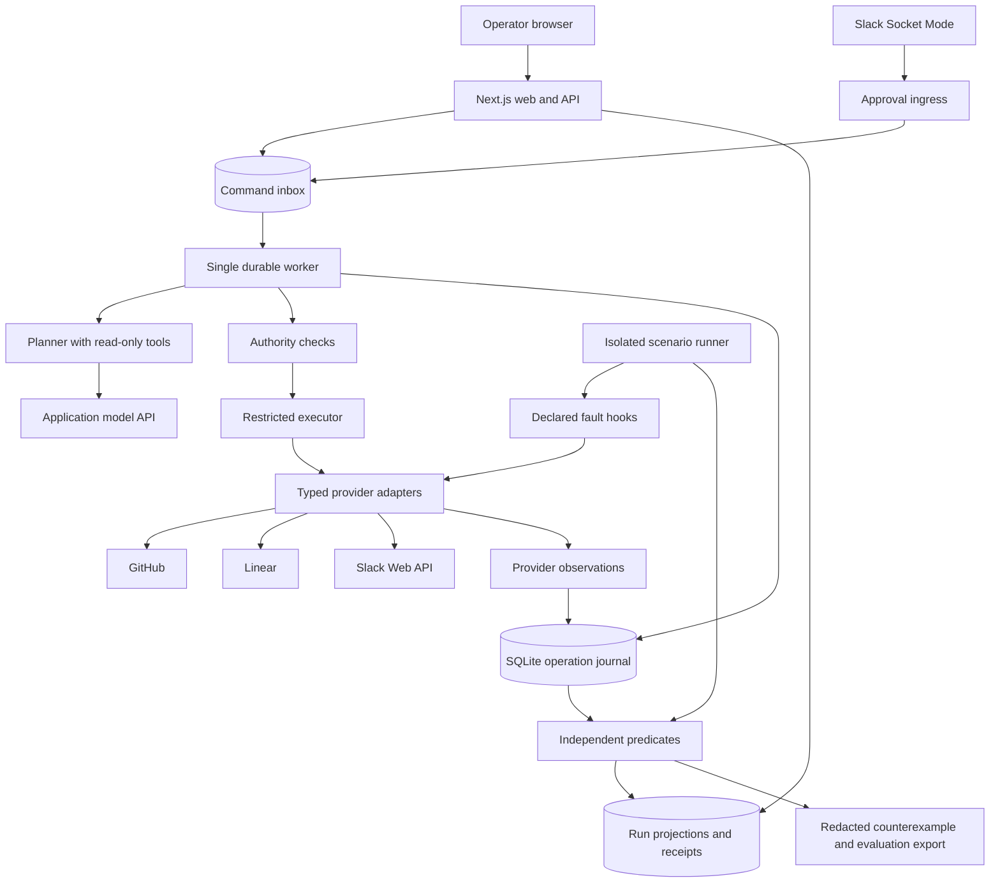

**ReleaseProof technical architecture**

**ADR-09 — delivery scope amendment (2026-09-14).** The user combined P3/P4/P5 into [one next phase](06-COMBINED-PHASE-3.md), followed directly by P6. The authority, persistence, isolation and receipt contracts remain required. Automatic exploration/minimization and Arga are deferred. P6 now includes hosted deployment verification on the existing single-host topology. Historical phase references yield to this amendment.

**A1. Product contract and operating boundary**

ReleaseProof coordinates one release across GitHub, Slack and Linear. Given a requested Linear issue, it gathers linked code evidence, proposes a specific prerelease, obtains approval for an immutable manifest, executes the authorized operations and verifies the resulting external state. Its verification package executes a fixed scenario corpus and exports an authored, replayable counterexample plus the corrected result.

The initial deployment is a single operator, one configured workspace, one allowlisted GitHub repository, one Slack channel and one Linear team. Real demonstrations use dedicated test resources. A GitHub prerelease is the final code-delivery artifact; this application does not deploy to production. The development repository used by Codex for commits should be separate from the disposable release-demo repository.

The five business rules are: approval binds the actual release; the reviewer has authority; checks cover the actual revision; uncertain operations do not cause blind repeated writes; and completed status reflects observed app state. Safety and useful completion are both required. Publishing still-valid A after unrelated branch drift is a positive case.

Treat these as point-in-time checks within the declared operating boundary. An administrator changing remote state afterward, a malicious process on the application host, or hostile concurrent tag mutation is outside the demo's guarantee. Native provider controls are necessary for stronger isolation. Do not represent a local test campaign as universal formal verification.

**A2. Runtime topology and responsibilities**



The database shapes are logical tables in one SQLite file, not separate services. There are two application processes: the Next.js web process and a long-lived Node worker. Scenario runs execute through the worker with isolated environment contexts. The local fixture provider may run as a child HTTP server during tests; it is test infrastructure rather than a third production service.

| Component | Owns | Must not do |
| --- | --- | --- |
| Web/API | Operator session, request validation, command insertion, read models | Call write-capable provider APIs or declare task success from browser state |
| Approval ingress | Authenticated Slack envelope validation, durable capture, acknowledgment | Let an arbitrary user, channel or old message approve a release |
| Planner | Evidence gathering and a proposed typed plan | Access credential strings, create approvals, publish releases or change policies |
| Executor | Preconditions, reserved operations, explicit provider calls | Accept a mutable branch name in place of approved commit identity |
| Journal | Durable attempts, observed effects and recovery state | Treat a missing response as proof that nothing happened |
| Verifier | Pure rules over normalized evidence | Ask the acting model to grade its own run |
| Scenario runner | Seed, valid actor events, fault placement, reset and replay | Route unsupported test requests to a real provider as fallback |
| Receipt projector | User-readable claims with source references | Display unobserved writes as completed |

Use one serial execution loop per worker. A second accidental worker must fail startup by attempting to bind the same fixed loopback singleton port, 4319, before consuming commands. Bind to 127.0.0.1 exclusively, retain the listener for the process lifetime and fail if occupied. This is a single-host deployment guard, not distributed fencing or protection against a malicious local process. Do not introduce automatic lease takeover or multiple worker replicas in this version.

Each worker tick advances at most one workflow step, then processes queued ingress commands before reserving the next external effect. Do not execute an entire release as one monolithic handler that ignores cancellation and approval changes until completion. Network calls remain bounded and cancellation is explicitly pending while an already-issued call is unresolved.

**A3. Concrete stack and dependency choices**

| Concern | Choice | Rationale |
| --- | --- | --- |
| Language | TypeScript with strict checking | Shared contracts and explicit failure types |
| Runtime | Node 24.21.0 LTS; record the exact maintained patch in P1 | Node 22.14.0 on the planning host reached end of life on 2026-07-28; P1 validated Node 24.21.0 as the maintained LTS and uses a project-local runtime until the host is upgraded |
| Workspace | npm workspaces, one root package-lock.json | Small reproducible repository without extra build-system setup |
| Web | Next.js App Router and React; local Node hosting | Product screen and thin route handlers |
| Worker | Node process launched with tsx in development, compiled TypeScript for delivery | Durable execution independent of browser requests |
| Contracts | Zod plus exported TypeScript types | Validate all external boundaries, not just compile-time callers |
| Persistence | better-sqlite3, numbered SQL migrations, SQLite WAL | Explicit short transactions and easy restart tests |
| Model | Official OpenAI JavaScript SDK, Responses API, one configured model ID | Small tool loop with structured output; exact accessible model chosen and recorded in P1 |
| GitHub | Typed adapter over fetch and official REST endpoints | Explicit requests, error classification and transport fault injection |
| Linear | Typed fixed GraphQL documents over fetch | Small operation set with visible data/errors handling |
| Slack | @slack/socket-mode and @slack/web-api | Local approval interaction without a public webhook |
| Tests | Vitest for domain/integration tests; Playwright for a few browser journeys | Verify business behavior and the visible product |
| UI updates | Poll the local run projection approximately once per second while active | No dependence on persistent browser sockets |
| Logs | Structured JSON with a central redactor | Correlation without credential leakage |

P1 must pin the actual dependency versions and verify the native SQLite dependency on the installed Windows environment. The maintained Node lines and SQLite package requirements should be checked during setup. Do not insert a fabricated version into the plan. [Node releases](https://nodejs.org/en/about/previous-releases), [better-sqlite3](https://github.com/WiseLibs/better-sqlite3).

Run the worker separately because some Next.js hosts terminate long handlers and do not offer persistent filesystems. This topology requires a persistent disk shared by the two processes on the same host. [Next.js deployment constraints](https://nextjs.org/docs/app/guides/backend-for-frontend).

Keep runtime configuration validation lazy at server/worker startup. Importing a module during the web build must not require provider credentials, open a real database or make a network request. Dynamic run pages read state at request time; CI builds with no real provider secrets. Verify native SQLite packaging in the actual Next.js/Node deployment during P1.

**A4. Repository structure and dependency direction**

The following paths describe the target repository layout; inspect build state and source for current implementation status.

```text
AGENTS.md                         Small instructions entry point for Codex
README.md                         Installation, run commands and demonstration
package.json                      npm workspaces and required scripts
package-lock.json                 Reproducible dependency versions
.env.example                      Variable names and harmless examples only
.gitignore                        Secrets, databases and raw artifacts excluded
.github/workflows/ci.yml          Checks for the committed code; no provider keys
outputs/releaseproof-build/       This implementation package and build state
apps/
  web/
    app/                          Routes, login and release workspace
    components/                   Timeline, approval summary, receipt, scenarios
    lib/server/                   Session verification, command writer, queries
  worker/
    src/main.ts                   Singleton startup, migrations check, main loop
    src/approval-ingress.ts       Slack Socket Mode adapter
packages/
  contracts/src/                  DTOs, schemas, enums, event and evidence types
  core/src/
    domain/                       Manifest, policy rules and state transitions
    application/                  Prepare, publish, reconcile, complete handlers
    persistence/                  Database access and transactional repositories
    agent/                        Read-tool registry and structured planner
    providers/                    GitHub, Linear, Slack and transport adapters
    verification/                 Predicates, fixed scenarios and safe replay
    evidence/                     Observation normalization, redaction, receipts
    config/                       Environment registry and startup validation
migrations/                       Ordered SQL files and schema version
config/demo-environment.example.json   Nonsecret allowlist template
tests/
  domain/                         Authority, ordering and transition tests
  integration/                    Actual adapters against stateful fixtures
  browser/                        User-visible journeys
  fixtures/                       Synthetic data, actors and provider server
  scenarios/                      Scenario declarations using evaluation IDs
scripts/                          doctor, verify, eval, replay and export CLIs
evidence/                         Redacted phase records and compact results
artifacts/private/                Ignored raw runs, database copies, debug output
artifacts/shareable/              Explicitly reviewed exports and media index
var/                             Ignored SQLite files and local execution state
```

Browser components may import contracts, never core/provider/storage modules. Core domain and verifier predicates depend on contracts and pure values; they do not import Next.js, SDK clients or process.env. Application handlers receive ports by dependency injection. The worker composition root creates real clients. Web server code uses only the command/query persistence entry points. Enforce these boundaries with package export maps and restricted-import lint rules.

Keep the verifier callable through a small interface: reset environment, apply an allowed event, drive the agent to the next declared hook, observe state and evaluate predicates. The ReleaseProof agent implements that interface; a future agent adapter should not require replacing the predicates or evidence schema.

**A5. Configuration, identities and secrets**

Use environment variables for secrets. Create a validated nonsecret environment registry containing an environment ID, provider modes, exact base URLs, workspace/team/channel IDs, repository ID and name, reviewer user IDs, required check identities, permitted issue states and release-tag prefix. Resolve this registry before a run starts and store its nonsecret fingerprint with the run. Freeze the mapping for the lifetime of that run.

If configuration changes across restart, do not silently remap an old run to new destinations or authority. Reconcile already-issued operations using their recorded identities where access remains valid; block new protected writes until the new configuration/policy is reviewed and the required approval is renewed. The manifest policyVersion and environment fingerprint must agree with the active execution context.

Required settings: DATABASE_PATH, APP_ORIGIN, OPERATOR_PASSWORD, SESSION_SECRET, OPENAI_API_KEY, OPENAI_MODEL, GITHUB_TOKEN, SLACK_BOT_TOKEN, SLACK_APP_TOKEN and LINEAR_API_KEY. The exact model ID must pass a small structured-tool smoke test before being recorded as selected. Do not assume the Codex session's login supplies the application's API credentials. No model purchase or billing change is part of this plan.

Provider mode is one of fixture, arga or real_test. Each adapter records its own mode, endpoint identity and environment instance. A mixed run must display those modes per provider and cannot be labeled fully real or fully twin. Default CI and scenario exploration to fixture. Real-test writes require an explicit run environment already allowlisted by the operator; never accept arbitrary URLs, repositories or credential names from a model response.

Use separate demo credentials and a repository tag prefix such as rp-demo-. Scope the GitHub token to the dedicated repository with the reads needed for PR/check evidence and Contents write for releases. Account for extra workflow-file permissions if the selected commit requires them. Slack needs chat:write and channel read/history access for the configured channel; the app-level token needs connections:write for Socket Mode. Prefer one dedicated public channel; private-channel scopes must be added only if actually used. Linear access should be restricted to the test team where available and validated against configured IDs.

The demo provides application-level single-workspace authorization, not audited multi-tenant isolation. Credentials remain on the worker host. Retrieved issue descriptions and Slack content are untrusted task data and cannot expand permissions or rewrite instructions.

Operator access, model credentials and runtime release credentials are separate from Codex's GitHub push access. A successful source-code push does not establish that the application can create a prerelease, read Slack history or update a Linear issue.

**A6. Domain contracts**

```ts
type ProviderMode = 'fixture' | 'arga' | 'real_test';
type RuleResult = 'pass' | 'fail' | 'inconclusive' | 'not_applicable';

type Manifest = {
  schemaVersion: 1;
  environmentId: string;
  environmentFingerprint: string;
  repositoryId: string;
  repositoryFullName: string;
  commitSha: string;
  tagName: string;
  releaseKind: 'prerelease';
  releaseTitle: string;
  releaseBodyHash: string;
  linearTeamId: string;
  issues: { issueId: string; releasedStateId: string }[];
  slackTeamId: string;
  slackChannelId: string;
  requiredChecks: { name: string; appId: string; headSha: string }[];
  policyVersion: string;
};

type Observation<T> = {
  observationId: string;
  runId: string;
  provider: 'github' | 'slack' | 'linear';
  mode: ProviderMode;
  environmentId: string;
  objectId: string;
  observedAt: string;
  sourceUrl: string | null;
  requestCorrelationId: string;
  data: T;
};

type ProviderOutcome<T> =
  | { kind: 'observed'; value: T; observationId: string }
  | { kind: 'not_sent'; reason: string }
  | { kind: 'rejected'; code: string; retryAfterMs?: number }
  | { kind: 'unknown'; reason: string }
  | { kind: 'unsupported'; capability: string };
```

The authority manifest contains stable release-critical fields only. Canonicalize a versioned fixed-key representation, sort issue and check collections, normalize identifiers and hash the canonical UTF-8 bytes with SHA-256. Persist those bytes, the release body and its digest. Run IDs, timestamps and explanatory prose live outside the authority object. Release body changes, destination changes or issue-set changes create a new manifest and require a new approval.

The release operation is reserved by environment/repository/tag independently of the manifest hash. Two requests cannot evade duplicate protection by choosing different manifest hashes for the same tag. A second request with an identical manifest may observe the existing operation; a different manifest must report a conflict.

A Slack button contains a random approval-intent ID and nonce reference, not a trusted copy of the manifest. The server resolves the immutable manifest itself. An approval stores intent ID, manifest hash, team/channel/message IDs, reviewer ID, nonce, creation/expiry times and decision. A valid Slack delivery proves transport authenticity; the configured reviewer allowlist establishes authority.

**A7. Database and transaction design**

Use foreign_keys=ON on every connection, journal_mode=WAL, a bounded busy timeout and synchronous=FULL for the durability demonstration. All transactions remain short; no network or model call occurs inside one. WAL permits readers alongside a writer but requires the participating processes to share the same host filesystem. Do not put the database on a network share. [SQLite WAL](https://sqlite.org/wal.html).

| Table | Important fields and constraints |
| --- | --- |
| runs | id, environment_id, request_key, request_hash, phase, status, version, manifest_id, created_at; UNIQUE(environment_id, request_key) |
| commands | id, run_id, kind, expected_version, dedupe_key, payload_json, status, error_code, created_at; UNIQUE(dedupe_key) |
| manifests | id, hash, canonical_json, release_body, created_at; UNIQUE(hash), immutable application API |
| approvals | id, run_id, manifest_id, intent_nonce, team/channel/message/user IDs, decision, expires_at, reserved_operation_id; UNIQUE(intent_nonce) |
| operations | id, run_id, manifest_id, kind, target_key, effect_key, status, next_attempt_at, remote_object_id; UNIQUE(environment_id, effect_key) |
| attempts | id, operation_id, ordinal, reserved_at, sent_at, result_kind, completed_at; UNIQUE(operation_id, ordinal) |
| observations | id, run_id, attempt_id nullable, provider, mode, object_id, observed_at, normalized_json, payload_digest |
| events | id, run_id, sequence, kind, actor, correlation_id, payload_json, created_at; UNIQUE(run_id, sequence) |
| scenario_runs | id, scenario_id, environment_id, seed, schedule_json, implementation_digest, rule_results_json, status |
| schema_migrations | version, applied_at, checksum |

Include environment_id as an explicit column on operations and all environment-scoped records. Index commands(status, created_at), operations(status, next_attempt_at), events(run_id, sequence), observations(run_id, provider), and scenario_runs(scenario_id, seed). Versioned migrations must run against a stopped worker, fail on checksum mismatch and be idempotent when reapplied. A dev reset may delete only an explicitly resolved fixture database inside var/fixtures/; real-run databases are not reset by a generic command.

Three atomic boundaries matter:

1. **Accept request:** insert run, first command and RunRequested event together. Same key/same request returns the existing run; same key/different request returns 409.
2. **Reserve effect:** verify the current run version and authority, insert or claim its unique operation, add the next attempt, bind the approval reservation and append AttemptReserved in one transaction.
3. **Record observation:** persist remote observations, operation outcome, event and run projection update together. The UI reads projections generated from these committed observations.

The event journal is application evidence, not a tamper-proof or cryptographically attested audit log. The database is the operational source of truth; a redacted log line is not a substitute for a committed state transition.

**A8. State machines and cancellation semantics**

```text
Run phase:
requested -> gathering -> planned -> awaiting_approval
-> publishing -> updating_apps -> verifying -> complete

Run status:
active | waiting_for_approval | waiting_for_provider | reconciling
| partially_complete | needs_attention | cancelled | failed | completed

Operation:
planned -> reserved -> sent -> observed -> verified
                         \-> unknown -> reconciling -> observed
                         \-> rejected
```

State transitions are functions of the previous state and committed command/observation. A run reaches completed only when the receipt's required predicates pass. Normal branch drift is an event, not automatically a failure state. A timeout after dispatch puts the operation in unknown and the run into reconciling; it cannot create completed or a definitive failure by itself.

The worker performs execution serially. Slack ingress and web requests enqueue commands; they do not invoke publication directly. A cancellation is pending until the worker processes it. If processed before effect reservation, it prevents publication. Once the publish attempt is reserved/dispatched, cancellation cannot retract an in-flight remote effect; it can stop new effects and request reconciliation. The UI must say that execution has started and expose any observed partial result.

Persist cancellation intent. Retry must not silently undo it: an unknown cancelled operation can be reconciled by reads, but new writes require an explicitly valid new workflow decision. Readback of an already-issued effect remains permissible and does not count as resuming publication.

Approval expiry is checked immediately before each new protected attempt. Expiry after a previously authorized dispatch does not erase a successful observed effect; recovery may record that effect and finish the already-approved reporting steps. It does not authorize a new publish after expiry. If an expired approval corresponds to an unknown attempt, reconcile without issuing a new write.

Recheck expiry immediately before dispatch if any wait occurred after reservation. If it expired before anything was sent, record not_sent and require renewed authority for publication. The reserved timestamp must not extend approval indefinitely.

**A9. Planner and authority separation**

The model receives the request, bounded normalized evidence and read-only tools: read_issue, read_linked_pr, read_check_evidence and inspect_existing_release. Tool handlers enforce environment and object allowlists. Cap input text lengths, returned collection sizes, wall time and tool rounds. Initial design budgets: eight read-tool rounds, two minutes of planner time and a configured per-run model-token ceiling; these are limits to implement, not measured performance.

Use the Responses API's structured output for the proposal, strict tool schemas and parallel_tool_calls=false to simplify causal traces. The SDK documentation defines tool invocation and structured response handling. Handle model refusal, incomplete output and schema validation failure explicitly. Schema-valid content still requires application-level validation. [Function calling](https://developers.openai.com/api/docs/guides/function-calling), [structured outputs](https://developers.openai.com/api/docs/guides/structured-outputs).

The server validates each proposed issue/PR relationship against observed explicit links, verifies merge/check evidence, validates all target identities and constructs the authority manifest. It does not accept model-generated evidence IDs that were never observed. Persist model ID, prompt version/digest, tool inputs/outputs after redaction, usage and concise task explanations. Do not require or store hidden chain-of-thought.

Recovery of a persisted manifest does not call the model to invent a replacement plan. It uses deterministic handlers. A changed task creates a new plan and approval. This keeps language understanding useful while preserving exact authority.

**A10. Provider-specific adapter contracts**

Every adapter has healthCheck(), capabilityCheck(), read(), execute() and observe() operations appropriate to its provider. Inject Transport, Clock and FaultController in tests. Generic automatic retries are disabled for writes, including SDK-level retry behavior; the durable executor owns retry decisions and their accounting. Reads use bounded retries respecting provider limits.

| Provider | Required capabilities | Observation that establishes success |
| --- | --- | --- |
| GitHub | Repository identity; PR details; checks/statuses; release lookup/create; Git ref and annotated-tag resolution | Release ID exists for the expected tag; tag resolves to approved SHA; expected prerelease/body marker and repository match |
| Slack | auth.test; post/update message; read configured channel messages; Socket Mode button delivery | Approved message identity and reviewer captured; final message read back contains expected receipt identifier and outcome |
| Linear | viewer/team identity; issue and workflow state; issueUpdate; linked-release annotation via one supported attachment/comment method | Target issue state read back; expected release annotation located and tied to the operation |

Choose and pin one Linear annotation method in P1 after a schema capability probe. Default to a comment with a stable receipt marker, then query the issue's comments to reconcile. An uncertain create must be searched by marker before another create is considered; unresolved absence stops automatic retries. This bounded choice is recorded as a capability decision, not spread across the code as fallback branches.

GitHub: a pre-existing tag makes target_commitish ineffective, so inspect its underlying commit before publication and again afterward. Resolve annotated tags recursively with a depth bound and cycle detection. Check evidence matches the actual SHA and configured check identity, including app identity where supported. Use the configured native protections. The demo permits a maintainer to update the candidate branch; it does not claim to prevent an administrator concurrently rewriting a release tag. [Release API](https://docs.github.com/en/rest/releases/releases).

Linear: distinguish personal-key and OAuth header formats, inspect GraphQL errors even with HTTP 200, and read the updated issue. Never overwrite the full issue description to add a receipt. Before changing state, confirm the issue still belongs to the configured team and is in an allowed predecessor state; unexpected changes become needs_attention. Its API does not make this cross-provider workflow atomic. [Linear API](https://linear.app/developers/graphql).

Slack: default to Socket Mode, receiving button interactions through the app's authenticated connection. Validate the expected app/team/channel/message/action, reviewer ID, nonce and expiry, then durably capture the decision and acknowledge promptly. Use a short transaction and target acknowledgment within 2.5 seconds; no model or external API call occurs in that handler. If capture fails, do not acknowledge as though accepted; retry/deduplication must be tested. [Socket Mode](https://docs.slack.dev/tools/node-slack-sdk/socket-mode/).

Persist the raw envelope's dedupe identifier and a business-level decision key, because repeated transport delivery and repeated clicks are different cases. A duplicate accepted decision returns an acknowledgment without creating another publish command. A late conflicting decision cannot rewrite an already-reserved approval.

If HTTP callbacks are later adopted, implement Slack signature verification over the untouched raw body and enforce the timestamp window before parsing. Socket Mode and HTTP authentication are different transport paths; do not bolt HMAC checks onto Socket Mode envelopes. [Slack HTTP verification](https://docs.slack.dev/authentication/verifying-requests-from-slack/).

**A11. Side-effect protocol and ambiguous outcome recovery**

```text
For one operation:
  1. Load immutable manifest and its current operation record.
  2. If a previous attempt is unknown or interrupted, reconcile first.
  3. Check identity, current authority and operation-specific preconditions.
  4. Atomically reserve the unique effect and record the attempt.
  5. Record dispatch intent, then call the adapter outside the transaction.
  6. On a response, persist its normalized outcome.
  7. Independently read the relevant remote object.
  8. Mark verified only when the readback satisfies the operation contract.
  9. Schedule the next unfinished operation.
```

A crash between recording dispatch intent and actually sending the request is also uncertain after restart. Conservatively reconcile; a local sent flag cannot prove a remote effect exists. All reserved/sent attempts without a conclusive outcome are recovered this way.

For a GitHub publish, use one stable tag and a receipt marker containing operation ID and manifest hash in the release body. These markers are correlation data, not authentication. Reconciliation requires a matching repository, tag, commit, release kind, marker and expected body. Matching result: adopt its remote ID and continue. Conflicting result: needs_attention. Unknown result: perform bounded reads, then remain reconciling/needs_attention without a new publish.

Initial readback schedule: immediately, then after approximately 1, 2, 4 and 8 seconds, with provider Retry-After taking precedence and a maximum reconciliation window recorded in configuration. A 404 can hide access problems; validate repository visibility using the same credentials before treating it as absence. Do not blindly retry an ambiguous write even if a bounded lookup sees nothing. The manual Retry control resumes reconciliation for unknown attempts. Only an explicit not_sent result or a conclusive retryable rejection allows a new attempt, after authority is rechecked.

Classify post-dispatch connection loss, a worker crash, malformed successful write payload and ambiguous 5xx as unknown unless provider semantics prove otherwise. Classify validation/permission rejection separately. Rate limiting uses recorded bounded backoff. After the budget expires, show the unresolved operation and let the operator investigate; do not fabricate success or silently change identifiers to make a retry work.

Use distinct effect keys for GitHub release creation, each Linear state change, each Linear receipt annotation, Slack approval creation and Slack final update. Slack initial message creation and Linear comment creation can also have uncertain outcomes. Search within the configured resource for the unique intent/receipt marker; adopt one match, flag multiple matches and stop if absence is unresolved. An existing Slack message can be updated and read back by its known message ID.

GitHub success followed by Linear failure stays partially_complete. Keep the valid release, reconcile pending steps and update Slack to describe the partial result. Never delete a valid release as cosmetic rollback. This is coordinated recovery, not a transaction across SaaS providers or a claim of global exactly-once execution.

**A12. HTTP API and operator session**

All application API routes use the Node runtime, JSON schemas, a bounded request body and consistent errors. The app binds to loopback by default. Login verifies OPERATOR_PASSWORD and issues an HttpOnly, SameSite=Strict signed session cookie; use Secure when served over HTTPS. Check the configured Host/Origin and a session-bound CSRF header on state-changing routes. Do not accept an untrusted workspace ID as authorization. Public deployment requires the same session controls and persistent hosting.

| Endpoint | Request | Response and semantics |
| --- | --- | --- |
| POST /api/session | password | Session cookie and CSRF token; never log the submitted password |
| GET /api/health | none | Web/database/worker heartbeat; no credentials or external writes |
| GET /api/connections | none | Sanitized provider capabilities and last observed health |
| POST /api/runs | requestKey, issueIdentifier, releaseIntent | 202 with runId; same key/body returns existing run; conflict returns 409 |
| GET /api/runs/:id | none | Versioned projection, phase/status, next valid actions, observed app outcomes |
| GET /api/runs/:id/events?after=N | sequence cursor | Ordered redacted events and next cursor, bounded page size |
| POST /api/runs/:id/retry | expectedVersion | 202 with commandId; resumes recovery, never bypasses approval |
| POST /api/runs/:id/cancel | expectedVersion | 202 queued cancellation; eventual result visible on command/run |
| GET /api/commands/:id | none | queued/applied/rejected and typed reason |
| GET /api/runs/:id/receipt | none | Evidence-backed receipt; includes pending and inconclusive states |
| POST /api/scenario-runs | scenarioId, seed, environmentId | 202; operator session and explicit isolated-environment capability required |
| GET /api/scenario-runs/:id | none | Declared limits, actual exploration/replay results and modes |
| GET /api/scenario-runs/:id/export | none | Redacted counterexample JSON; server-selected path only |

There is no normal HTTP endpoint that approves a release by accepting a reviewer ID from the browser. Approval arrives through the genuine Slack channel. Fixture-only approval injection exists inside the test harness and cannot be enabled for a real environment.

Errors use { code, message, retryable, correlationId, details } with codes such as INVALID_REQUEST, VERSION_CONFLICT, APPROVAL_REQUIRED, APPROVAL_EXPIRED, TARGET_CONFLICT, PROVIDER_UNKNOWN, CAPABILITY_UNSUPPORTED and BUDGET_EXCEEDED. Return plain actionable messages in the UI and put technical details in an expandable evidence view. A queued command is not a claim that its effect has happened.

**A13. Independent verification, exploration and replay**

Implement the rule IDs and scenario contracts in 05-EVALUATION-CONTRACT.md. Predicates consume normalized observations plus the declared policy and manifest. They return pass/fail/inconclusive/not_applicable, evidence references and a reason. Unknown or missing observations never become pass. The acting model cannot modify predicate definitions.

Under ADR-09, execute a fixed set of authored, actor-valid schedules at named hooks. Keep one fixture-only baseline/corrected comparison, reset each run, and export the actual schedule with its evidence. Replay the exported schedule through adapters and the executor; reject invalid prerequisites, arbitrary remote URLs and credential references. Run one changed-identity/timing holdout.

Automatic schedule search and dependency-preserving reduction are deferred. Do not call the authored trace discovered, minimized, shortest or exhaustive. Retain the safe replay schema and distinguish recorded synthetic planner replay from fresh model execution.

**A14. Fault injection and evidence provenance**

The primary fault is drop_response_after_apply on one identified GitHub publish attempt. The transport forwards one real request, consumes the successful remote response, withholds it from the worker and emits a timeout. It does not fabricate the release. A private observer may record what happened but cannot feed the hidden response into the worker's recovery logic.

Fixture processes maintain actual mutable provider state independently of the agent; they must reject malformed requests and implement relevant errors. Importing the agent's own predicate into the fake provider to determine its response would invalidate independence. ADR-09 defers twin and Arga integration; no unsupported method may fall back to a real service.

Every claim has a provenance level: model candidate, fixture reproduced, twin reproduced or real-test reproduced. Every export lists per-provider modes, unsupported capabilities, expected vs actual results, actual attempt counts and observation times. Pass/fail animation must read persisted results. No synthetic result may appear as a real API observation.

**A15. Product interface and receipt design**

Use one release workspace: task input, three connection indicators, a proposed release summary, approval state, execution timeline and evidence drawer. Keep raw schemas and mode setup out of the normal customer flow; retain a visible mode label in the demo/test area so evidence is not misleading.

The receipt answers: what was requested; who approved which revision; what GitHub actually published; whether Linear and Slack match; and what remains pending. Display source links, remote object identifiers and observation times on expansion. It remains useful even during partial completion. A browser refresh, navigation away or worker restart must reconstruct the same view from committed state.

UI performance targets are design goals: local command acceptance within 500 ms when the database is healthy; active status reflected within two seconds; Slack ingress acknowledgment within 2.5 seconds. Measure achieved values and disclose provider/model latency separately. Do not report these targets as benchmarks.

**A16. Delivery boundary and later production work**

Ship two processes on one persistent host, a restart procedure, environment template, sample fixture data, migrations, evaluation commands, redacted evidence and a two-minute demo. ADR-09 makes authenticated hosted deployment a P6 deliverable. Use one persistent host with HTTPS and runtime secrets; verify actual hosting access and native SQLite support. Preserve a reproducible local delivery if access blocks deployment and mark hosting incomplete. Do not place SQLite on an ephemeral serverless filesystem.

After evidence of customer use, consider Postgres, a durable queue, authenticated multi-workspace tenancy, OAuth installation, encrypted credential management, provider-native concurrency controls and operational monitoring. Multi-worker scaling requires a new side-effect concurrency design; adding a lease does not automatically fence an already-issued external API request. These are future changes with migration plans, not unfinished prerequisites hidden inside the hackathon scope.

The distinctive implementation should be understandable from three artifacts: the authority manifest, the durable operation history and the independently checked receipt. Each must agree with the others and with observed provider state.
